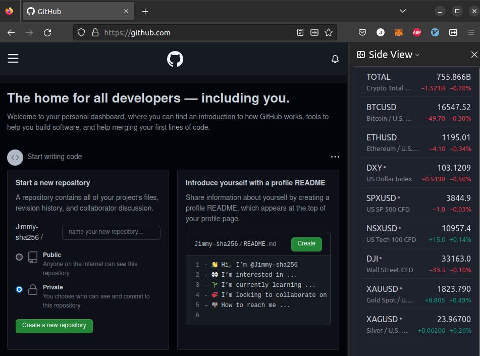

# Trading View Widget Web Page for FireFox Side View Extension



## Requirements

Mozilla extension: Side View

* https://addons.mozilla.org/en-US/firefox/addon/side-view/

* https://github.com/mozilla/side-view/


## Install Ubuntu 20.04

Grant correct permissions and execute setup.sh to configure apache2 server

```sh
sudo chmod 777 setup.sh && ./setup.sh
```

Check installation success by opening http://widget.tv 

## Adding tickers

Get ticker symbol from https://www.tradingview.com/widget/market-quotes/

add tickers to `index.html` like below example starting on line 34 of `index.html`

```json
          "tabs": [{
            "title": "Watchlist",
            "symbols": [
              {"s": "CRYPTOCAP:TOTAL"},
              {"s": "INDEX:BTCUSD"},
              {"s": "INDEX:ETHUSD"},
              {"s": "CAPITALCOM:DXY"},
              {"s": "FOREXCOM:SPXUSD"},
              {"s": "FOREXCOM:NSXUSD"},
              {"s": "FOREXCOM:DJI"},
              {"s": "OANDA:XAUUSD"},
              {"s": "OANDA:XAGUSD"},
              {"s": ""}
            ]
          }]        
```

If `index.html` is changed from within the `TV_Widget/` project folder, copy the new version of `index.html` to `/var/www/widget.tv/html/` folder.

Reload server to apply new configuration

```sh
sudo cp index.html /var/www/widget.tv/html/index.html
sudo systemctl reload apache2
```
